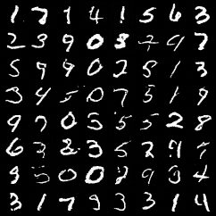
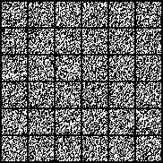
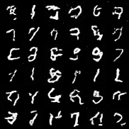
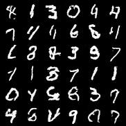
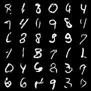
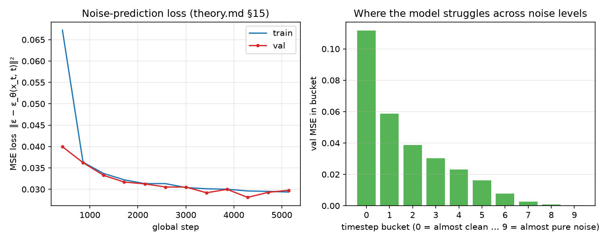
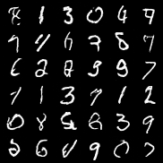
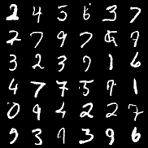

# DDPM Lab — Lesson 01: train a diffusion model on MNIST from scratch

This lab turns the math of **`theory.md`** (a complete DDPM derivation) into
runnable code. You train a model that learns to turn pure noise into MNIST digits,
watching every formula from the theory become a line of Python.

The whole thing is ~1000 lines of heavily-commented code. **Read `theory.md`
first** — every code comment references it by section (e.g. `theory.md §15`).
For a guided tour of the noise-predictor architecture itself (blocks, skips,
time embedding, attention), see **[`../unet.md`](../unet.md)** — the U-Net,
opened up.

---

## What you'll build

A **DDPM** (Denoising Diffusion Probabilational Model, Ho et al. 2020):

1. **Forward process** — gradually corrupt an image with Gaussian noise until
   it's pure static (theory.md §3).
2. **Train a network `ε_θ(x_t, t)`** to predict the noise that was added
   (theory.md §15–16). The loss is just `‖ε − ε_θ‖²`.
3. **Sample** by starting from noise and reversing the process step by step
   (theory.md §17, stochastic DDPM) — or much faster with **DDIM** (theory.md §18).

Here's what 12 epochs of training produce (64 digits, DDIM sampler):



---

## Quickstart

### Requirements
- A GPU with ≥ 6 GB VRAM (tested on an RTX 2060 / 6 GB). CPU works but is slow.
- [uv](https://docs.astral.sh/uv/) for dependency management.
- NVIDIA drivers compatible with CUDA 12.1 (the torch wheels are CUDA 12.1).

### Install & train

```bash
cd lessons/01-ddpm-from-scratch/lab
uv sync                       # creates .venv and installs pinned deps
uv run python scripts/train.py
```

The first run downloads MNIST into `data/`. Training logs to TensorBoard:

```bash
tensorboard --logdir runs     # open http://localhost:6006
```

You'll see:
- `train/loss`, `val/loss` — the noise-prediction MSE.
- `val/loss_bucket_0..9` — the loss split into 10 timestep buckets. This shows
  *where* the model struggles (theory.md §15 drops the per-`t` weight; these
  curves reveal what it was hiding).
- `samples/ddim` — a grid of freshly-generated digits, **refreshed every epoch**
  from a fixed seed so you watch them get sharper.
- `val/coverage`, `val/nn_class_distribution` — diversity / mode-collapse proxies.
- `compare/ddim`, `compare/ddpm` — the same seed run through both samplers.

A typical run: **~10–20 epochs** to recognizable digits, ~10–15 s/epoch on a 2060.

### Generate from a checkpoint

```bash
uv run python scripts/sample.py \
  --checkpoint checkpoints/<your-run>-best.ckpt \
  --sampler ddim --num-steps 25 --num-samples 64 --seed 0
# → writes samples/samples-ddim-seed0.png
```

Try `--sampler ddpm` for the slow stochastic path (1000 steps), or DDIM with
`--num-steps 50` and `--eta 1.0` to interpolate toward DDPM's stochasticity.

---

## Watching it learn

These images come from a real 12-epoch run on an RTX 2060 (val/loss ≈ 0.028).
Regenerate them from your own logs with
`uv run python scripts/export_readme_assets.py`.

**The same seed, denoised by progressively-trained checkpoints.** The
`SamplingCallback` reuses one fixed starting noise `x_T` every epoch, so each
grid below is literally "the same noise, understood better":

| Before training | Epoch 0 | Epoch 3 | Epoch 7 | Epoch 11 |
|---|---|---|---|---|
|  |  |  |  |  |

**Loss curves.** Left: the noise-prediction MSE (theory.md §15) drops fast and
keeps improving. Right: the same loss split into timestep buckets — the model
predicts noise almost perfectly in the mid range, while the hardest steps are at
the extremes (nearly-clean images leave little noise signal; pure noise has no
image signal left). This is the visual counterpart of the "weight dropping"
discussion in theory.md §15:



**DDPM vs DDIM from the same seed** (theory.md §17 vs §18). Notice the DDIM grid
is *pixel-identical* to the epoch-11 grid above — with `η = 0` and a fixed seed,
DDIM is fully deterministic, which is exactly what lets it skip steps. DDPM adds
fresh noise at every step, so its images differ from both:

| DDIM (deterministic, η=0, 25 steps) | DDPM (stochastic, 1000 steps) |
|---|---|
|  |  |

## Project layout

```
lab/
├── README.md                 ← you are here
├── pyproject.toml            ← deps (torch, lightning, tensorboard, ...) for uv
├── uv.lock                   ← pinned versions — reproducible envs
├── configs/
│   └── default.yaml          ← all hyperparameters
├── scripts/
│   ├── train.py              ← single entry point for training
│   ├── sample.py             ← generate images from a checkpoint
│   └── export_readme_assets.py ← pull README images out of a TB run
├── src/ddpm_lab/
│   ├── schedules.py          ← linear β schedule (theory.md §3)
│   ├── core.py               ← DiffusionCore: q_sample, predict_x0, loss (§4/§14/§15)
│   ├── models/
│   │   ├── common.py         ← shared sinusoidal time embedding
│   │   ├── mlp.py            ← ε_θ as an MLP (the transparent baseline)
│   │   ├── unet.py           ← ε_θ as a small U-Net (default; better quality; see ../unet.md)
│   │   └── __init__.py       ← build_model(cfg) factory
│   ├── samplers/
│   │   ├── ddpm.py           ← stochastic sampler (theory.md §17)
│   │   ├── ddim.py           ← deterministic, fast sampler (theory.md §18)
│   │   └── __init__.py       ← build_sampler(name)
│   ├── data.py               ← MNISTDataModule (download, normalize, split)
│   ├── metrics.py            ← loss-by-t bucket, coverage, mode-collapse
│   ├── lightning_module.py   ← DDPMLightningModule: train/val steps (theory.md §16)
│   ├── callbacks.py          ← SamplingCallback: fixed-noise grids each epoch
│   └── config.py             ← load_config(): default.yaml + CLI overrides
├── tests/
│   └── test_core.py          ← sanity checks for the math (q_sample ↔ predict_x0, VP)
└── (generated, gitignored): data/, runs/, checkpoints/, samples/
```

---

## Configuration

All hyperparameters live in [`configs/default.yaml`](configs/default.yaml).
Override any key on the command line:

```bash
uv run python scripts/train.py optim.lr=5e-4 model.type=mlp train.epochs=50
uv run python scripts/train.py --config configs/my_config.yaml
```

| Key | Default | Meaning | Theory ref |
|-----|---------|---------|------------|
| `diffusion.num_timesteps` | 1000 | T | §3 |
| `diffusion.beta_start` / `beta_end` | 1e-4 / 0.02 | linear β range | §3 |
| `model.type` | `unet` | `unet` or `mlp` | §15 |
| `model.base_channels` | 64 | U-Net width | — |
| `data.train_batch_size` | 128 | train batch size | — |
| `optim.lr` | 2e-4 | Adam learning rate | §15 (DDPM default) |
| `train.epochs` | 20 | training epochs | — |
| `train.precision` | `16-mixed` | mixed precision (use `32-true` to disable) | — |
| `callbacks.sampler` | `ddim` | sampler for per-epoch viz | §18 |
| `callbacks.num_sample_steps` | 25 | DDIM steps for viz | §18 |
| `callbacks.eta` | 0.0 | DDIM stochasticity | §18 |
| `metrics.num_t_buckets` | 10 | loss buckets over t | §15 |

**Smoke test** (a few seconds, no full epoch):

```bash
uv run python scripts/train.py train.epochs=1 train.limit_train_batches=10 callbacks.num_samples=16
```

---

## What to expect / troubleshooting

**"How long until the digits look like digits?"** With the default U-Net, you'll
see structure by epoch ~5 and clearly recognizable digits by ~10–20.

**CUDA out of memory.** The defaults fit 6 GB at `batch_size=128`. If you OOM,
reduce it: `data.train_batch_size=64` (or `32`). You can also shrink the U-Net
(`model.base_channels=32`) or disable mixed precision isn't the fix — keep
`train.precision=16-mixed` (it saves memory).

**MNIST download fails.** `torchvision.datasets.MNIST` downloads from an S3
mirror; on network issues, retry or download the 4 gzip files manually into
`data/MNIST/raw/`.

**DDPM sampling is slow.** That's expected — 1000 steps × one network call each.
For exploration use DDIM with 25–50 steps (≈ 30–40× faster, similar quality).

**The MLP produces noise, not digits — and that's the lesson.** A fully-connected
network flattens the image and must learn *every* pixel-pair relationship
independently, with no notion that adjacent pixels are related. On 60k MNIST this
isn't enough: the MLP plateaus at val/loss ≈ 0.4–0.7 (depending on size) while
the U-Net reaches ≈ 0.03, so the MLP's samples never resolve into digits. This is
*expected* — it's the whole reason the comparison exists. To see it clearly:

```bash
# Pure MLP (no spatial bias at all): worst, ~0.7 loss
uv run python scripts/train.py model.type=mlp model.use_local_conv=false train.epochs=20
# MLP with one 3×3 conv before flatten: a bit better, ~0.4 loss, still no digits
uv run python scripts/train.py model.type=mlp model.use_local_conv=true  train.epochs=20
# U-Net (default): ~0.03 loss, clear digits
uv run python scripts/train.py model.type=unet train.epochs=20
```

The lesson: the U-Net's quality comes from **architectural inductive bias**
(convolutions + multi-scale skip connections), not just parameter count — an MLP
larger than the U-Net still loses by 10×.

**TensorBoard shows no images.** Make sure validation ran — images are logged at
`on_validation_epoch_end`. With `limit_train_batches` but full epochs, this is
fine. If you stopped mid-epoch, no images for that partial epoch.

---

## On the metrics (why no FID)

This lab deliberately avoids **FID/Inception Score**: Inception-v3 is ~80 MB,
was trained on ImageNet (a poor feature space for MNIST), and adds a heavy
dependency for limited insight on a teaching dataset.

Instead we use two simple, dependency-free metrics (see `metrics.py`):

- **Loss bucketed by `t`** — directly illustrates theory.md §15's "weight
  dropping": shows the model's noise-prediction error at each noise level.
- **Coverage / mode-collapse** — for each generated image, find its nearest
  neighbor among real MNIST images in pixel space. *Coverage* = fraction of real
  images that are someone's NN (high = diverse). The *NN class histogram* reveals
  mode collapse (if the model only draws 1s and 7s, those bins dominate).

**For a sharper metric** (optional exercise): train a small CNN classifier on
MNIST and compute coverage/mode-collapse in its feature space instead of pixel
space. The code is structured to make this swap easy.

---

## Tests

The math is unit-checked. Run:

```bash
uv run python -m pytest tests/ -q
# or without pytest:
uv run python tests/test_core.py
```

These verify: the schedule values, `q_sample` ↔ `predict_start_from_noise` are
mutual inverses, the variance-preserving property (`x_T` has variance ≈ 1), and
the loss is plain unweighted MSE.

---

## Reference

- **`theory.md`** (in the parent directory) — the complete DDPM derivation this
  lab implements.
- Ho, Jain, Abbeel (2020), *Denoising Diffusion Probabilistic Models* — the
  original DDPM paper.
- Song, Meng, Ermon (2020), *Denoising Diffusion Implicit Models* — the DDIM
  paper (theory.md §18).
