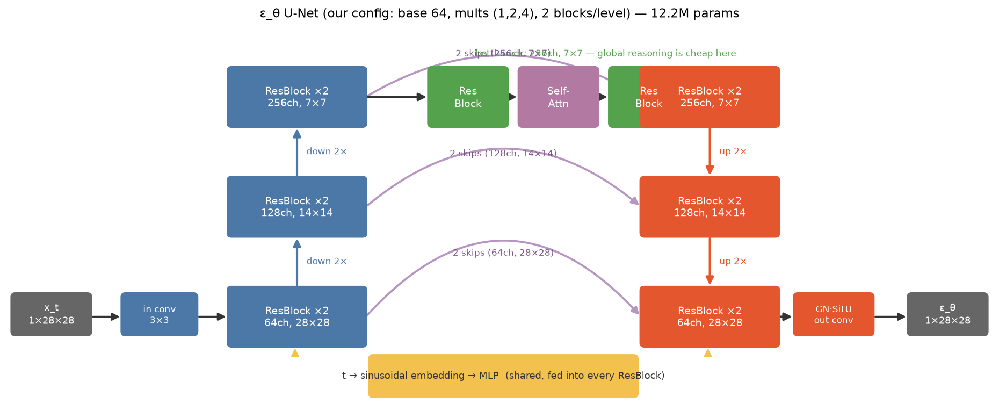
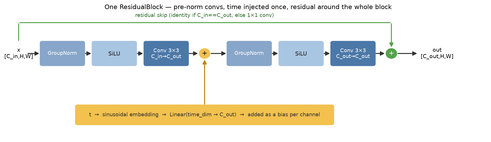

# Anatomy of ε_θ: the U-Net, opened up

**Companion to [`theory.md`](theory.md) and the [`lab/`](lab/) code.**
`theory.md` §15 treats the noise predictor as a black box: *"пусть нейросеть
предсказывает шум ε_θ(x_t, t)"*. This document opens that box. Every name in
here maps to a class in [`lab/src/ddpm_lab/models/unet.py`](lab/src/ddpm_lab/models/unet.py),
and every choice is explained with a "why".

---

## 1. What the network must actually do

Re-read the contract (theory.md §15–16). At training time we hand the network a
noisy image and a timestep, and it must return the noise:

```
input:  x_t  [B, 1, 28, 28]   (noisy digit)
        t    [B]              (how noisy: 1 = barely, 1000 = pure static)
output: ε    [B, 1, 28, 28]   (the noise that was added)
```

Three jobs hide in that signature:

1. **Image → image, same size.** Whatever we build must map 28×28 to 28×28.
2. **It must know `t`.** Denoising `x_t` at `t = 30` (almost clean — subtract a
   tiny bit carefully) is a completely different task from `t = 970` (almost pure
   noise — guess the digit's coarse shape). Same input pixels, different answer.
3. **It needs both local and global reasoning.** Stroke continuity is local
   (neighboring pixels); "is this blob a 0 or an 8" is global (top and bottom of
   the digit must agree).

A plain convnet with a few strides and one final upsample *could* do 1 and 3.
What makes the architecture a **U-Net** is how it keeps detail while still doing
 coarse→fine reasoning — and the answer is skip connections.

> Reminder from the lab README: an **MLP** fails exactly at job 3's spatial part.
> It flattens 28×28 into 784 unrelated numbers and plateaus at val/loss ≈ 0.4–0.7
> (vs the U-Net's ≈ 0.03). Parameters are not the issue — structure is.

---

## 2. The big picture



Flow left to right, down the encoder, through the bottleneck, up the decoder.
For our config (`base_channels=64`, `channel_mults=(1,2,4)`, `unet_blocks=2`):

| Stage | Resolution | Channels | Notes |
|---|---|---|---|
| input | 28×28 | 1 | `x_t` |
| `in_conv` (3×3) | 28×28 | 64 | just a channel expansion |
| encoder level 0 | 28×28 | 64 | 2 × ResBlock → **2 skips saved** |
| ↓ downsample | 14×14 | 64 | stride-2 conv |
| encoder level 1 | 14×14 | 128 | 2 × ResBlock → **2 skips saved** |
| ↓ downsample | 7×7 | 128 | |
| encoder level 2 | 7×7 | 256 | 2 × ResBlock → **2 skips saved** |
| bottleneck | 7×7 | 256 | ResBlock → **SelfAttention** → ResBlock |
| decoder level 2 | 7×7 | 256 | 2 × ResBlock, each eats one 256-ch skip |
| ↑ upsample | 14×14 | 128 | nearest + conv |
| decoder level 1 | 14×14 | 128 | 2 × ResBlock, each eats one 128-ch skip |
| ↑ upsample | 28×28 | 64 | |
| decoder level 0 | 28×28 | 64 | 2 × ResBlock, each eats one 64-ch skip |
| `out_conv` (3×3) | 28×28 | 1 | GroupNorm + SiLU first |

Total: **12.2M parameters**. Where they live is itself instructive:

| Component | Params | Share | Why |
|---|---|---|---|
| decoder blocks | 5.4M | 44% | each block takes `concat(features, skip)` → double input channels |
| encoder blocks | 3.0M | 25% | |
| bottleneck (+attn) | 2.8M | 23% | works at 7×7 but with 256 channels |
| up/downsamplers | 0.9M | 7% | |
| time embedding | 0.1M | 1% | tiny, but touches every block |

The self-attention in the bottleneck is only ~0.3M params (2%) — cheap because
it runs at 7×7 (49 tokens). That's deliberate; see §6.

ASCII version, for terminal readers:

```
x_t [1,28,28]                                              ε_θ [1,28,28]
     │                                                          ▲
 ┌───▼───┐   skips    ┌─────────┐    ┌─────────┐    ┌────────┐  │
 │in conv│──┐         │         │    │         │    │ GN·SiLU├──┘
 └───────┘  │         │         │    │         │    │out conv│
            ▼         ▼         │    │         ▼    └────────┘
        ╔═════════╗   │         │    │      ╔═════════╗
        ║ Res×2   ║───┼──2×64───┼────┼─────▶║ Res×2   ║   28×28
        ║ 64,28²  ║   │         │    │      ║ 64,28²  ║
        ╚════╦════╝   │         │    │      ╚════╦════╝
             ▼ down   │         │    │           ▲ up
        ╔═════════╗   │         │    │      ╔═════════╗
        ║ Res×2   ║───┼──2×128──┼────┼─────▶║ Res×2   ║   14×14
        ║128,14²  ║   │         │    │      ║128,14²  ║
        ╚════╦════╝   │         │    │      ╚════╦════╝
             ▼ down   │         │    │           ▲ up
        ╔═════════╗   │         │    │      ╔═════════╗
        ║ Res×2   ║───┴──2×256──┼────┼─────▶║ Res×2   ║   7×7
        ║256, 7²  ║              │    │      ║256, 7²  ║
        ╚════╦════╝              │    │      ╚════▲════╝
             ▼                   │    │           │
        ┌───────────┐            │    │           │
        │ Res       │            │    │           │
        │ SelfAttn  │────────────┴────┘           │
        │ Res       │────────────────────────────┘
        └───────────┘   bottleneck, 256ch @ 7×7

t [B] ──▶ sinusoidal embedding ──▶ MLP ──▶ into EVERY ResBlock (yellow path)
```

---

## 3. The time embedding: how `t` gets in

`t` is an integer. We can't just feed a raw int into a convnet. The standard
trick — borrowed from Transformers — is a **sinusoidal positional encoding**:
embed `t` as a vector of sines and cosines at geometrically spaced frequencies:

```
emb(t)[2k]   = sin(t · exp(−k·log(10000)/d))
emb(t)[2k+1] = cos(t · exp(−k·log(10000)/d))
```

then pass it through a small 2-layer MLP (`time_embed`, ~0.1M params). Nearby
`t`'s get similar vectors; distant `t`'s get very different ones. One embedding
module is shared by the whole network (in `models/common.py`, so the MLP
baseline uses the identical encoding — a fair comparison).

That vector is then injected into **every residual block** (§4) as a per-channel
bias. Every level of the network knows how noisy the input is.

Could we instead give `t` as an extra input channel? People have tried; it
works worse. A scalar channel is one number the convs must learn to decode
everywhere; a rich embedding is a whole feature vector, and adding it deep in
every block lets even the 7×7 level behave differently for `t=30` vs `t=970`.

---

## 4. The workhorse: one ResidualBlock



The recipe (`ResidualBlock` in `unet.py`):

```
h = Conv3×3( SiLU( GroupNorm(x) ) )      # pre-norm activation-conv
h = h + Linear_time(MLP(t))              # time injection, per-channel bias
h = Conv3×3( SiLU( GroupNorm(h) ) )      # second pre-norm activation-conv
out = h + skip(x)                        # residual; 1×1 conv if channels change
```

Why each ingredient:

- **Conv 3×3, twice.** Two stacked 3×3 convs see a 5×5 receptive field with
  fewer parameters and more nonlinearity than one 5×5 — the classic VGG fact.
- **GroupNorm, not BatchNorm.** Diffusion trains with a *random* `t` per sample,
  so batch statistics are noisy mixtures of very different noise levels.
  GroupNorm normalizes per-sample per-group, no batch dependency. (Big DDPM
  implementations switched BN→GN for exactly this reason; we start with GN.)
- **Pre-norm** (normalize *inside* the branch, keep the residual path clean):
  gradients flow through `out = h + skip(x)` unimpeded — the same reason
  Transformers went pre-norm.
- **Time injected once per block**, right after the first conv, as an added
  bias. Minimal, and enough — the block's convs do the rest.
- **Residual around the whole block.** Worst case the block learns identity;
  10+ stacked blocks stay trainable.

---

## 5. Why the U-shape? Downsampling and skips

**Why downsample at all?** A 3×3 conv at 28×28 sees 3 pixels of context; the
same conv at 7×7 sees a quarter of the image. Downsampling buys receptive field
— the ability to reason about the digit *as a shape*, not as texture. It also
concentrates compute: 256 channels at 7×7 costs far less than at 28×28.

**Why skips?** Downsampling throws away exactly the pixel detail that the final
output needs (an error of one pixel in the noise estimate is a visible error in
`x₀`). The skip connections are the detail highway: each encoder block's output
is concatenated onto the matching decoder level, so the decoder *adds* global
reasoning to preserved local detail instead of reconstructing detail from
memory.

Empirically this matters enormously — remove the skips and samples get mushy
and global structure wobbles (a worthwhile experiment: delete the
`torch.cat([h, skip], dim=1)` line, retrain, watch `val/loss` and samples).

**Mechanically** (see `UNet.forward`): the encoder pushes every block's output
onto a stack (`skips.append(h)`); the decoder pops one skip per decoder block
(`skips.pop()`), so counts and channel widths match by construction. Each
decoder ResBlock therefore takes `concat(h, skip)` — that's why decoder blocks
have ~44% of all parameters.

---

## 6. Self-attention — only at the bottleneck

Attention lets every position exchange information with every other position —
perfect for "global consistency", quadratic in the number of positions —
perfect for blowing up memory. The compromise every small diffusion U-Net makes:
**attention at the lowest resolution only**.

At 7×7 an attention map is 49×49 ≈ 2.4k entries per head — trivial. At 28×28 it
would be 784×784 ≈ 600k, ×batch, ×heads — noticeable for marginal gain (by 28×28
the conv stack's receptive field is nearly global anyway).

Our `SelfAttention` is multi-head (4 heads), pre-norm, with a residual:

```
out = x + Proj( Attention(QKV(GroupNorm(x))) )
```

where Q, K, V come from 1×1 convs and attention runs over the 49 spatial
positions. It costs ~0.3M params (2% of the model) and is where "the top and
bottom of the digit agree on what digit this is" happens.

> The original DDPM paper used attention at 16×16, 8×8, 4×4 (for 32×32 images).
> For a teaching lab, bottleneck-only keeps the code to one class and the memory
> budget comfortable.

---

## 7. What this U-Net deliberately does *not* have

Honesty about omissions (all fine for MNIST; all standard in bigger models):

- **No learned variance.** The network predicts ε only; the sampler's `σ_t`
  comes from the schedule (theory.md §15 fixes it). Nichol & Dhariwal (2021)
  showed learning a interpolated variance improves log-likelihood — a good
  lesson-2+ topic.
- **No multi-resolution attention** (see §6).
- **No EMA of weights** — big DDPMs stabilize generation with an exponential
  moving average copy of the network; at MNIST scale the effect is small.
- **No dropout by default** (`model.dropout: 0.0`), no normalization tricks
  beyond GroupNorm, no FiLM/scale-shift time conditioning (we use additive bias
  — simpler to read, same spirit).

---

## 8. Code map

| Concept | Where in `lab/src/ddpm_lab/models/` |
|---|---|
| sinusoidal time embedding | `common.py` → `SinusoidalTimeEmbedding` |
| residual block (time-injected) | `unet.py` → `ResidualBlock` |
| self-attention (bottleneck) | `unet.py` → `SelfAttention` |
| down/up sampling | `unet.py` → `Downsample` / `Upsample` |
| the U itself | `unet.py` → `UNet` (+ `UNetConfig` dataclass) |
| factory (`model.type: unet`) | `__init__.py` → `build_model(cfg)` |
| the MLP baseline | `mlp.py` |

Config knobs (`configs/default.yaml`, `model.` section): `base_channels`,
`channel_mults`, `unet_blocks`, `unet_time_embed_dim`, `dropout`. Halve
`base_channels` (→ 64→32, ~3M params) for a CPU-friendly run; raise the mults
for a bigger model (watch the 6GB budget).

**Memory check** (RTX 2060, 6GB): our config peaks at ~2.1GB during training at
batch 128 — comfortable headroom.

---

## 9. Suggested experiments

1. **Kill the skips** (§5): comment out the `torch.cat` + pop, retrain 5 epochs,
   compare samples. Fastest way to *feel* why the U matters.
2. **Kill the time embedding** (feed zeros instead of `t_emb`): the network can
   no longer tell noise levels apart; watch which loss buckets suffer (§15
   connection).
3. **Move attention to 28×28** (add it after level 0): measure the memory jump.
4. **Shrink to `base_channels=32`**: params drop ~4×, quality drops slower than
   that — a good lesson in where capacity matters.
