# Score Matching Lab — Lesson 02

Denoising score matching + annealed Langevin на 2D-датасетах, затем VE vs VP
на MNIST. Всё в одной лабе, всё воспроизводимо через `uv`.

## Quickstart

```bash
uv sync                                   # окружение
uv run python -m pytest tests/ -q         # математика: score, DSM, Ланжевен
uv run python scripts/train_2d.py         # 2D-пайплайн (~2 мин)
uv run python scripts/compare_ve_vp.py    # VE vs VP на MNIST (~1–1.5 ч на CPU, минуты на GPU)
uv run python scripts/eval_per_level.py    # пер-уровневый лосс VE vs VP (после compare)
uv run python scripts/compare_solvers.py   # SDE/ODE-солверы на готовых чекпойнтах (~1 мин на GPU)
```

Любое поле конфига переопределяется из CLI:

```bash
uv run python scripts/train_2d.py data.dataset=moons paths.run_dir=runs/moons
uv run python scripts/compare_ve_vp.py mnist_ve_vp.epochs=1   # быстрый прогон
```

Артефакты (PNG + CSV) пишутся в `runs/<exp>/`.

## Карта «раздел теории → код»

| Теория (theory.md) | Код | Что там |
|---|---|---|
| §2 Score-сеть `s_θ(x, σ)` | `src/score_lab/models.py` | `ScoreMLP`: (x, Fourier(log σ)) → score; одна сеть на все уровни лестницы |
| §4 Сэмплирование через Langevin dynamics | `src/score_lab/langevin.py` | `langevin_sample`: `x ← x + ε/2·s + √ε·z`, траектории, `mode_coverage` |
| §6 Score гауссиана — строительный блок | `src/score_lab/toy_data.py` | `GaussianMixture2D`: `log_p`, аналитический `score` (взвешенные ответственностями компоненты); `gaussians8`/`moons`/`swiss-roll` |
| §7 Denoising score matching | `src/score_lab/dsm.py` | `dsm_loss`: цель `−ε/σ` = `∇log q(x̃\|x)`; VE-зашумление `x̃ = x + σε` |
| §8 Многоуровневый шум | `src/score_lab/config.py` (`geometric_sigma_ladder`), `langevin.py` (`annealed_langevin`), `train_loop.py` | геометрическая лестница σ; шаг `ε_i = step_scale·σ_i²`; состояние переносится между уровнями |
| §9 Score и ε — одна сеть в разных одеждах | `src/score_lab/mnist_ve_vp.py` (докстринг + обучение ε) | `score = −ε/σ_t` для VE, `score = −ε/√(1−ᾱ_t)` для VP — одна и та же сеть |
| §10 VE vs VP | `src/score_lab/mnist_ve_vp.py`, `scripts/compare_ve_vp.py` | `VESchedule` (геом. σ 80→0.01, аддитивный forward) и `VPSchedule` (линейные β как в лабе 1); равный бюджет, side-by-side сэмплы |
| §11–12 Wiener, forward SDE | `src/score_lab/sde.py` | VE: `dx = σ(t)√(2ln r)·dW`; VP: `dx = −½β(t)x·dt + √β(t)·dW`, `t ∈ [0,1]`, β — дискретная × (T−1) |
| §13 Reverse SDE | `sde.py: reverse_sde_drift` | `f − g²·s_θ` через `s = −ε/std` (§9); Anderson (1982) |
| §14 Probability flow ODE | `sde.py: pf_ode_drift` | `f − ½g²·s_θ` — детерминированный двойник SDE |
| §15 Солверы, NFE | `src/score_lab/solvers.py`, `scripts/compare_solvers.py` | Euler-Maruyama (SDE) + Euler/Heun/RK4 (ODE), счётчик NFE + wall-clock, бенчмарк quality-vs-NFE |

## Как читать графики (runs/<exp>/)

### Плотность и поле score

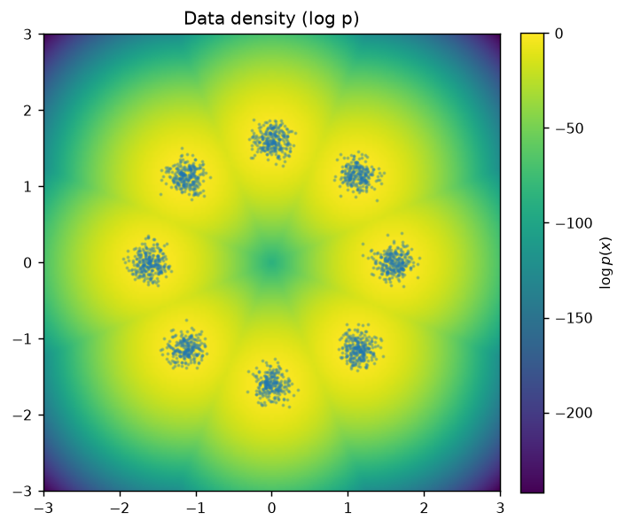
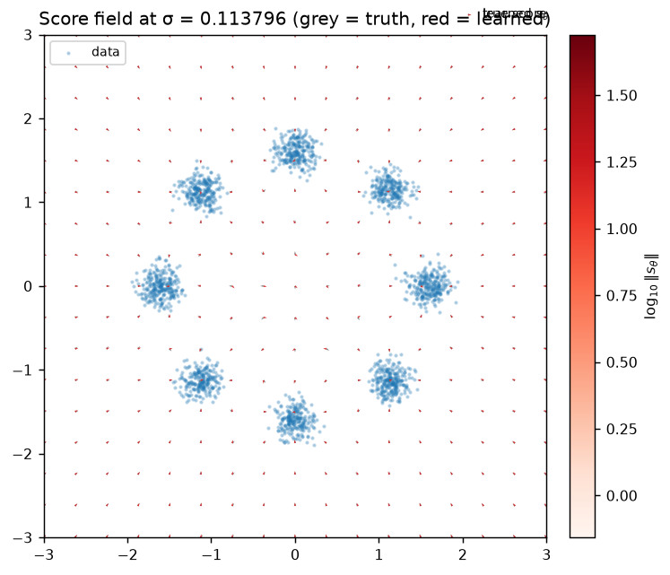

### Траектории и annealing

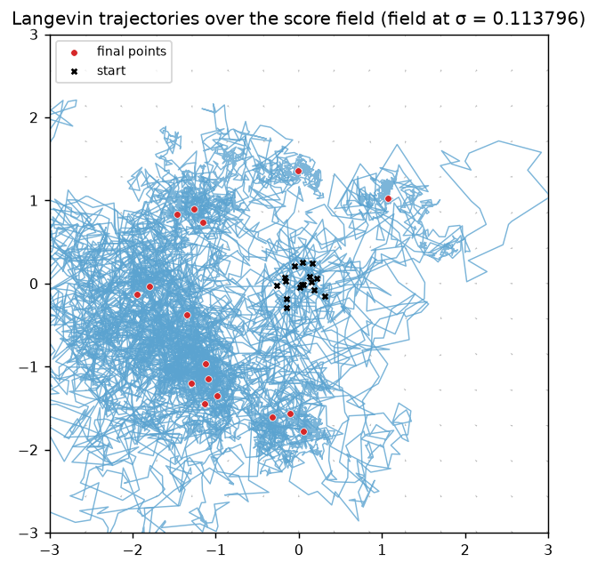
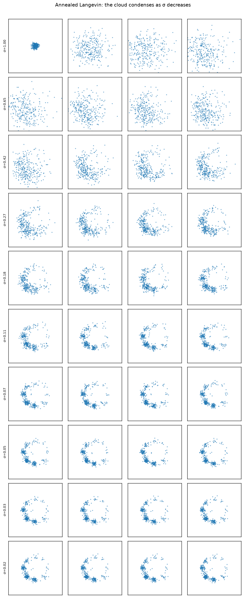

### Single-σ collapse (демо провала §8)

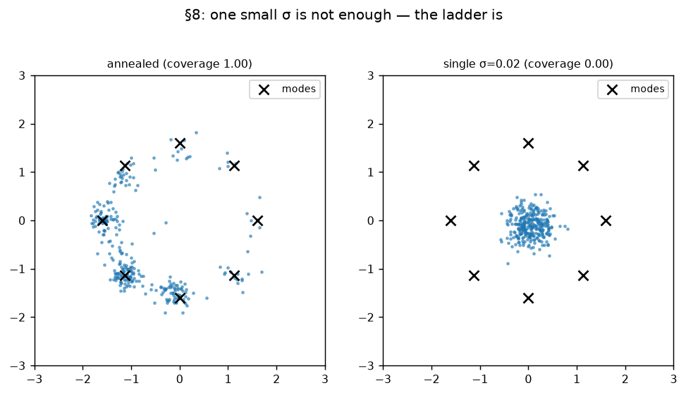

### VE vs VP на MNIST (§9–§10)

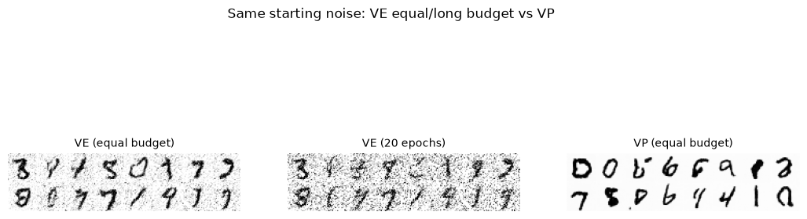
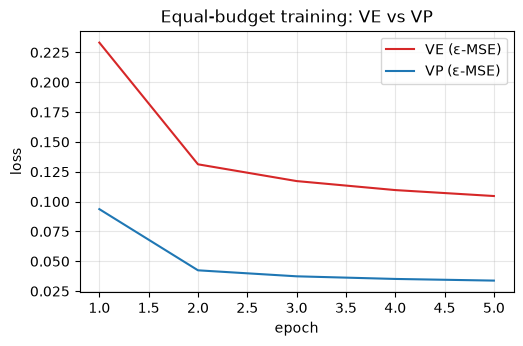
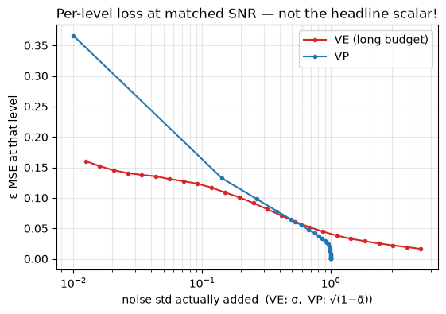


Цвета везде одни: **данные — синие точки, истинный score — серые стрелки,
выученный — красные**.

* **`density.png`** — heatmap `log p(x)` + сэмплы. Максимум плотности должен
  проходить вдоль данных.
* **`score_field_*.png`** — quiver-поле: серые стрелки (истина) vs красные
  (сеть) при большом/среднем/малом σ. Стрелки нормированы по длине — важное
  направление; магнитуда выученного поля видна в colorbar (`log₁₀‖s‖`).
  В high-density областях красные должны совпадать с серыми по направлению.
* **`trajectories.png`** — пути annealed-Ланжевена поверх quiver-поля:
  старт (`×`) → стекание к модам → финальные точки (красные маркеры) в зонах
  высокой плотности.
* **`annealing_grid.png`** — «видео-кадр» лабы: строки — уровни σ (от большого
  к малому), колонки — шаги внутри уровня. Смотрите, как облако размазано
  наверху и конденсируется в узкие моды к низу.
* **`single_sigma_collapse.png`** — демо провала §8: тот же старт и тот же
  финальный шаг, но без лестницы. Числа coverage в заголовках панелей.
* **`runs/ve_vs_vp/`** — `samples_side_by_side.png` (VE слева, VP справа,
  одинаковый стартовый шум), `loss_curves.png` (кривые обеих веток).

## Тюнинг Ланжевена

Шаг на уровне *i*: `ε_i = step_scale · σ_i²` (`langevin.step_scale`). Почему
квадрат σ: возле моды σ-сглаженной плотности update — OU-процесс со
стационарным разбросом ≈ ширина моды, т.е. масштабно-инвариантен на каждом
уровне. Фиксированный ε либо взорвётся на малых σ, либо заморозится на
больших.

Симптомы и лечение:

* сэмплы «дрожат» и не собираются в моды → уменьшите `step_scale` (0.05 → 0.02);
* сэмплы разлетаются/NaN → ещё меньше `step_scale`;
* слишком медленно → больше `langevin.steps_per_level` с меньшим `step_scale`,
  или больше уровней `sigmas.n_levels` (мельче лестница — короче прыжки).

## Связь score ↔ ε (обе ветки MNIST)

Обе ветки обучаются предсказывать ε простым MSE. §9: для гауссовского
зашумления score зашумлённой плотности — это `−ε / std шума`:

* VE: `x_t = x₀ + σ_t·ε` → `s_θ(x_t, t) = −ε_θ(x_t, t)/σ_t`
* VP: `x_t = √ᾱ_t·x₀ + √(1−ᾱ_t)·ε` → `s_θ(x_t, t) = −ε_θ(x_t, t)/√(1−ᾱ_t)`

## SDE/ODE-солверы (§11–15)

`compare_solvers.py` берёт **уже обученные** VE/VP модели и крутит на них
матрицу методов: {Euler-Maruyama на reverse SDE} × {Euler, Heun, RK4 на
PF-ODE} × NFE-бюджеты {40, 100, 400}. Все методы внутри ветки стартуют из
одного стартового облака — сравниваем только численную схему.

```bash
uv run python scripts/compare_ve_vp.py    # сначала: чекпойнты в runs/ve_vs_vp/
uv run python scripts/compare_solvers.py  # → runs/ve_vs_vp/solvers/
```

### Как читать график quality-vs-NFE

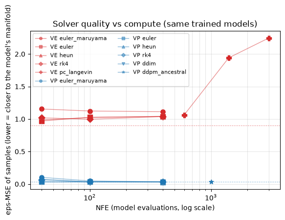

Сэмплы «солверы × бюджеты» (строки — методы, колонки — NFE; внутри ветки
стартовый шум один и тот же):

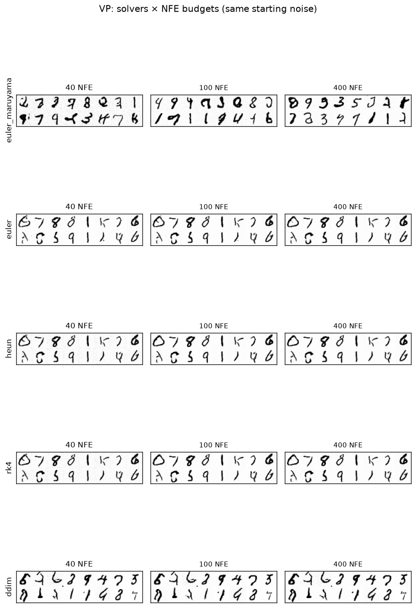
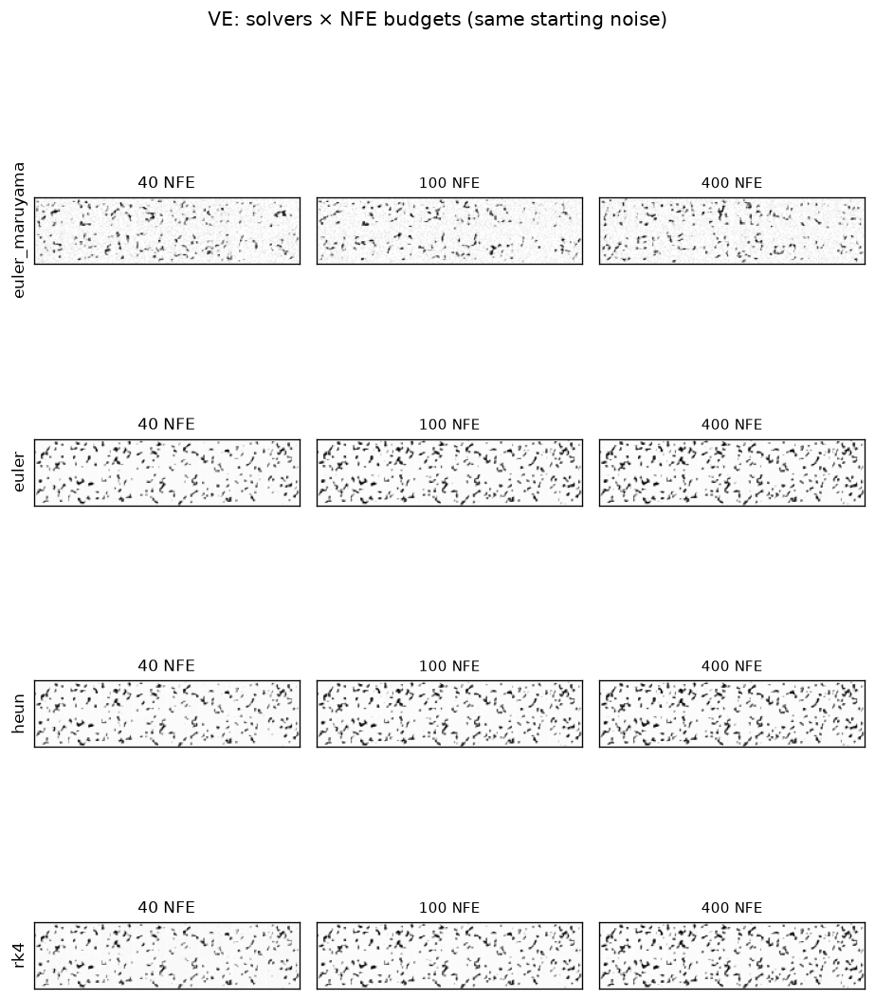

* **Ось X — NFE** (число вызовов модели, log-шкала): честная «валюта»
  сравнения — Heun тратит 2 вызова на шаг, RK4 — четыре.
* **Ось Y — eps-MSE сэмплов**: зашумляем каждый сэмпл на нескольких уровнях
  и меряем, как хорошо модель его денойзит. Сэмплы на выученном многообразии
  денойзятся как настоящие данные, уплывшие — хуже. Пунктирные линии —
  baseline на *реальных* MNIST-картинках: пол каждой ветки.
* **Вывод из запуска**: у VP детерминированный PF-ODE уже при 40 NFE
  достигает floor'а реальных данных (0.031 vs 0.036), а стохастическому
  Euler-Maruyama нужно ~400 NFE для того же. Heun/RK4 при равном NFE не
  выигрывают: drift кусочно-постоянен из-за квантования `t → индекс
  обучения`, и многостадийные схемы на нём теряют порядок. У VE все методы
  эквивалентны (~0.64 при floor 0.60): ε-модель VE сама по себе грубее.
* Сетки сэмплов по каждому прогону — в `solvers/<ветка>_<метод>_nfe<N>.png`;
  полный протокол с временем — `solvers/solver_benchmark.csv`.

### Сравнение с классикой: DDPM и DDIM

В бенчмарк включены два дискретных сэмплера урока 1 (только VP):

| Метод | NFE | Время (GPU) | eps-MSE |
|---|---|---|---|
| DDPM ancestral (полный T) | 1000 | ~16.3 с | 0.032 |
| **DDIM (η=0), 40 шагов** | **40** | **~0.64 с** | **0.034** |
| Euler на PF-ODE | 40 | ~0.67 с | 0.032 |

Две классические морали на одних числах: **(1)** DDIM и Euler на PF-ODE —
это одно и то же в разных одеждах (дискретный прыжок по x̂₀ vs интегрирование
ODE) — качества совпадают с точностью до погрешности; **(2)** детерминированная
траектория даёт **25× ускорение** при равном качестве: 40 вызовов сети вместо
1000. Антисемплинг не бесплатен у stochastic-ветки: Euler-Maruyama требует
~400 NFE, чтобы догнать DDPM по качеству.

VE в этой таблице нет сознательно: непрерывные солверы (reverse SDE, PF-ODE)
на его грубой ε-модели дают только шум даже при 8000 NFE — выручает лишь
NCSN predictor-corrector (Euler + Ланжевен-корректор на каждом уровне),
и то с бюджетом на порядок больше:

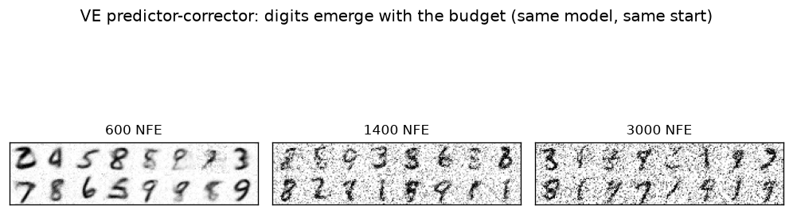

Пресеты — оригинальный `sample_ve` на фиксированной 200-уровневой лестнице
обучения: **600 NFE — чистые мягкие цифры**, 1400/3000 — цифры с нарастающим
зерном. Две важные оговорки из экспериментов вокруг:

* **Реализация шума решает**: тот же алгоритм, обобщённый на свободное число
  уровней и стартующий из внешнего облака (`solvers.pc_langevin_ve`), на всех
  бюджетах 40–800 давал шумовые облака вместо цифр — цепь с грубой моделью
  неустойчива к стартовой реализации шума. Симптом слабости модели, не баг.
* **Тяжёлый корректор добавляет зерно**: вес шума на 3000 NFE — от
  `corrector_steps=10`; Ланжевен-шум усиливает ошибку ε-модели. Внутренняя
  метрика (eps-MSE под собственной моделью) на таких сэмплах врёт (строки
  pc_langevin в CSV хуже шума) — смотрите на картинки.

Мораль прежняя: непрерывные SDE/ODE-солверы на этой модели дают чистый шум
(корректор обязателен), потолок качества ставит **модель**, не солвер —
лечится preconditioning'ом/взвешиванием (EDM), не тюнингом сэмплинга.

### Ограничения

* eps-MSE — **внутренняя** метрика (модель оценивает свои сэмплы):
  сравнивать солверы внутри ветки можно, ветки между собой — нет. Reference
  метрика качества (FID) требует внешних зависимостей и здесь сознательно
  не используется.
* DPM-Solver и другие солверы, эксплуатирующие полуаналитическую структуру
  PF-ODE, — тема отдельного урока про солверы.
* Время (wall-clock) на GPU почти линейно по NFE и почти не зависит от
  метода: узкое место — вызовы сети, а не арифметика шага.

Т.е. ε-сеть из лабы 1 и score-сеть этой лабы — одна сеть в разных
параметризациях; differs only bookkeeping σ(t).

## Известные упрощения

* **GMM-аппроксимация** для `moons`/`swiss-roll`: «истинный score» — это score
  GMM-приближения (≥50 узких компонент вдоль кривой), не «настоящая» плотность.
  На σ ≥ ширины компонент визуально неотличимо.
* **VE σ_max и шкала данных**: NCSN использует σ_max≈80 в своей шкале данных;
  MNIST тут нормализован к unit-variance (как в лабе 1), поэтому эквивалентный
  старт с SNR≈0 — σ_max≈5. Дефолт конфига — 5.0.
* **Упрощённый VE-сэмплер**: вместо честного annealed Ланжевена на каждом
  уровне — Euler-шаг по probability-flow ODE (`x ← x − Δσ·ε_θ`, с
  подразбиением) + Ланжевен-корректор-шаги на новом уровне (та же
  формула `x ← x + (α/2)s + √α z`, α = scale·σ², что и в 2D-части;
  дефолты 10 шагов / scale 0.15 подобраны так, чтобы облако отслеживало
  расписание σ — см. пункт про мыльные сэмплы ниже). Голый
  predict-x̂₀-прыжок не работает: при большом σ ошибка ε даёт ошибку x̂₀ ~ σ·δε.
* **VP-сэмплер** — ancestral DDPM из лабы 1 (полные T шагов, posterior variance).
* **Чёрные точки на фоне у VE (сильнее у лучше обученной сети) — не баг
  сэмплера.** Проверено: адаптивный NCSN-шаг корректора ничего не меняет, а
  без корректора цепочка расходится. Источник — сама ε-параметризация на
  малых σ: ε там почти невидим под сигналом, и при длинном обучении MSE
  подгоняется под шумовые паттерны train-сета → «уверенные» одиночные
  пиксели (у 5-эпоховой модели то же остаётся размытым фоном — поэтому её
  панель выглядит «чище», хотя цифры в ней хуже). Диагностика: доля
  изолированных ярких пикселей 11% (5 эпох) vs 14% (20 эпох) при вдвое
  большем контрасте выходов. Лечится в EDM preconditioning'ом
  (`c_skip/c_out` сглаживают уверенность сети на низких SNR) — ещё одна
  причина, почему наивный VE не сравнивают с VP «в лоб».
* **Почему скалярные лоссы VE/VP несравнимы — смотрите на уровни, не на среднее.**
  Средний ε-MSE каждой ветки — это среднее по *разным смесям* уровней шума:
  у VP с линейным β почти половина из 1000 таймстепов сидит при
  noise_std ≈ 1 (`x_t ≈ ε` — ε читается прямо со входа, лосс ~0.001), а у VE
  геометрическая лестница тратит половину уровней на σ < 0.2, где ε почти не
  виден под сигналом (лосс ~0.1). Поэтому «VE 0.09 vs VP 0.03» — не про
  качество сетей. `scripts/eval_per_level.py` строит пер-уровневый лосс на
  общей оси noise std (`per_level_loss.png`): при одинаковом SNR VE на
  низкошумовых уровнях (σ ≲ 0.4 — именно они определяют чёткость картинок)
  **не хуже и даже лучше VP**, просто у VP такие уровни в расписании почти не
  представлены (при t≈0 лосс VP 0.37 — недообучен там).
* **Почему тогда VE-сэмплы были мыльные — сэмплер, не сеть.** Euler-предиктор
  снимает меньше шума, чем нужно (ε̂ — усреднённый, с усечённой магнитудой), и
  при слабом корректоре (2 шага, scale 0.05) облако шло по лестнице с
  двукратным избытком шума (эмпирический std облака 0.71 при запланированном
  σ=0.41). С усиленным корректором (10 шагов, scale 0.15 — дефолт
  `sample_ve`) облако отслеживает расписание (0.41/0.41), и доля читаемых
  цифр заметно растёт. Это и есть мотивация preconditioning'а у EDM.
* **Про модель и взвешивание.** Модель нарочно миниатюрная, а ε-MSE без
  взвешивания λ(σ) — NCSN/EDM веса используют, без них большие σ
  недообучены. Ветка «VE long» (тот же сид, ×4 бюджета) показывает
  стабильное улучшение (0.105 → 0.090). Современные
  SOTA-модели (EDM, Karras et al. 2022) построены именно на VE-параметризации
  с preconditioning и σ-взвешиванием: при них VE не хуже, а часто лучше VP.
  Правильный вывод из демо: **«по скалярному лоссу ветки сравнивать нельзя —
  сравнивайте при одинаковом SNR; сэмплер решает не меньше, чем сеть»**, а не
  «VE не нужен».

## Регенерация картинок README

```bash
uv run python scripts/train_2d.py paths.run_dir=runs/gaussians8
uv run python scripts/train_2d.py data.dataset=moons paths.run_dir=runs/moons
uv run python scripts/compare_ve_vp.py
uv run python scripts/eval_per_level.py
uv run python scripts/compare_solvers.py
# затем вручную скопировать удачные PNG в ../images/ (закоммичено в репо)
```
